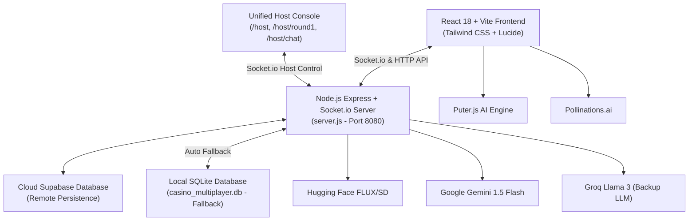

# AI Casino: The Ultimate Turing Test & Multiplayer Showdown 🎰🤖

[](https://react.dev/)
[](https://nodejs.org/)
[](https://supabase.com/)
[](https://deepmind.google/technologies/gemini/)
[](LICENSE)

An interactive, high-stakes, cyberpunk casino web application testing human perception against modern Artificial Intelligence. Features a 6-player real-time multiplayer video detection table, interactive casino side-action bonus games, prompt engineering image duels, blind Turing test chats with a 70/30 AI-to-Human split, live cloud leaderboards, and a unified host command center.

---

## 🔗 Live Deployments & Endpoints

| Portal | URL | Purpose |
| :--- | :--- | :--- |
| **🎮 Player Client** | [https://ai-casino-chi.vercel.app](https://ai-casino-chi.vercel.app) | Main contestant entry, table seating, and gameplay |
| **🕹️ Unified Host Dashboard** | [https://ai-casino-chi.vercel.app/host](https://ai-casino-chi.vercel.app/host) | Host command center for Round 1 tables & Round 3 Turing chat |
| **💬 Turing Host Console** | [https://ai-casino-chi.vercel.app/host/chat](https://ai-casino-chi.vercel.app/host/chat) | Dedicated human operator chat queue for Round 3 |
| **🎲 Round 1 Host Controller** | [https://ai-casino-chi.vercel.app/round1-host](https://ai-casino-chi.vercel.app/round1-host) | Standalone feed controller, timer overrides, and settlements |
| **⚙️ Operator Setup** | [https://ai-casino-chi.vercel.app/operator-setup](https://ai-casino-chi.vercel.app/operator-setup) | One-time browser authentication setup for Puter.js |
| **⚡ Backend WebSocket Server** | [https://ai-casino.onrender.com](https://ai-casino.onrender.com) | Express + Socket.io + SQLite/Supabase synchronization |

---

## 🎮 Complete Tournament Flow & Game Modes

Contestants buy into the tournament with a starting bankroll of **$50 chips**. The tournament progresses through 3 main championship rounds interspersed with 3 side-action casino lounges:

```
[Lobby & Table Selection] 
        │
        ▼
[Round 1: 6-Player Multiplayer Video Challenge]
        │
        ▼
[Stage I Intermission: Neural Wheel & Cyber Blackjack]
        │
        ▼
[Round 2: Creative AI Image Prompt Duel]
        │
        ▼
[Stage II Intermission: Quantum Dice & Data Pattern Dash]
        │
        ▼
[Round 3: The Turing Test (70/30 AI vs Human Chat)]
        │
        ▼
[Stage III Intermission: Cyber Minefield & Vault Decryption]
        │
        ▼
[Global Tournament Leaderboard & Hall of Fame]
```

---

### 1️⃣ Round 1: 6-Player Real-Time Multiplayer Video Showdown
- **Seated Multiplayer Experience:** Up to 6 players join custom or shared virtual tables (e.g., `TABLE_01`) with live seat pods (`S1` to `S6`).
- **Synchronized Visual Feeds:** Contestants view synchronized high-definition video challenges broadcast in real time across all connected clients.
- **Wager & Guess:** Players lock in bets ($10, $25, $50, or ALL IN) and choose whether the video is **REAL** or **AI-GENERATED** before the 45-second round timer expires.
- **Live Settlement:** The table host or automated timer reveals ground truth, instantly calculating chip earnings and updating bankrolls.

---

### 🎰 Stage I Intermission: Side Action Tables (Round 1.5)
- **Neural Wheel (Cyber Roulette):** Spin the probability wheel with risk tiers:
  - Low Risk: **1.5x Multiplier**
  - Medium Risk: **3x Multiplier**
  - High Risk: **5x Multiplier**
  - Direct Number Wagers: **10x Multiplier**
- **Card Game (AI Cyber Blackjack / High-Low):** Duel the AI dealer in high-speed card rounds with instant chip payouts.

---

### 2️⃣ Round 2: Creative AI Image Prompt Duel
- **Reverse Prompt Engineering:** Players read an original creative prompt and construct their own prompt interpretation.
- **Head-to-Head Generation:** The engine renders the player's generated visual alongside the reference AI visual.
- **6-Tier Fallback Engine:** Guarantees successful image rendering via automated graceful degradation across 6 independent providers.
- **Scoring:** Points and chip payouts awarded based on visual alignment and prompt creativity.

---

### 🎲 Stage II Intermission: Side Action Tables (Round 2.5)
- **Dice Game (Quantum Roll / Craps):** Predict quantum dice outcomes with tiered odds:
  - Over 7 / Under 7: **2x Payout**
  - Exact Number Match: **5x Payout**
  - Snake Eyes (Double 1s): **12x Jackpot Payout**
- **Data Pattern Game (Pattern Matrix Dash):** Test cognitive speed and short-term memory against an expanding AI matrix sequence under pressure.

---

### 3️⃣ Round 3: The Turing Test (Real-Time Blind Chat)
- **70/30 Blind Matchmaking:** Players are connected to a blind conversational terminal. In 70% of sessions, they converse with an advanced LLM (**Google Gemini 1.5 Flash** or **Groq Llama 3**); in 30% of sessions, they are matched with a **Live Human Operator** connected via `/host/chat`.
- **3-Message Deduction:** Contestants exchange up to 3 conversational turns, probing the respondent's syntax, emotion, and logic.
- **The Verdict:** Contestants place their final high-stakes wager on whether their respondent was **HUMAN** or **AI**.

---

### 💣 Stage III Intermission: Final Vault Lounge (Round 3.5)
- **Mines Game (Cyber Minefield):** Traverse a 5x5 grid of data nodes. Each revealed clean node escalates the cashout multiplier. Cash out at any time or risk losing your wager on a corrupted mine node.
- **Number Guess Game (Vault Decryption):** Crack a randomized encrypted vault passcode within limited attempts using dynamic higher/lower proximity hints.

---

### 🏆 Global Leaderboard & Hall of Fame
- Automatically saves player statistics, stage scores, bonus earnings, and final chip totals.
- Displays global ranking, timestamp, and contestant handle with real-time updates.

---

## 🛠️ Technical Architecture & Stack



### Core Technologies
- **Frontend Framework:** React 18, TypeScript, Vite
- **Styling & UI:** Tailwind CSS, Lucide React icons, responsive custom dark-mode theme
- **Real-Time Layer:** Socket.io (client & server) with custom heartbeat and room reconnection
- **Backend Framework:** Node.js, Express 5
- **Dual Database Engine:** 
  - **Primary:** Supabase PostgreSQL cloud tables (`ai_casino_players`, `tournament_leaderboard`)
  - **Fallback:** SQLite (`better-sqlite3` in WAL mode) with auto-healing recovery on startup
- **AI Models & Providers:**
  - **Chat & Turing Test:** Google Gemini 1.5 Flash, Groq (Llama-3.3-70b-versatile, Llama-3.1-8b-instant)
  - **Image Generation:** 6-tier waterfall (Puter.js -> Client Pollinations -> Backend Pollinations -> Hugging Face -> Local SVG procedural fallbacks)

---

## 🛡️ Resilient AI Fallback Engine

```
[Tier 1: Puter.js Client API]
        │ (if unavailable or unauthenticated)
        ▼
[Tier 2: Direct Pollinations.ai Client Request]
        │ (if client network blocks or CORS errors)
        ▼
[Tier 3: Backend Express Pollinations Proxy]
        │ (if server-side Pollinations times out)
        ▼
[Tier 4: Hugging Face Inference API (FLUX / SD)]
        │ (if rate-limited or quota exceeded)
        ▼
[Tier 5: Curated High-Definition Unsplash Fallbacks]
        │ (if offline)
        ▼
[Tier 6: Procedural Inline SVG Generation]
```

---

## 🎛️ Unified Host Command Center (`/host`)

The Host Command Center provides full operational control over live events:

1. **Round 1 Multiplayer Table Controller (`/host/round1`):**
   - Live visual monitor of all 6 player seats (`S1` - `S6`), player handles, chip counts, and ready flags.
   - Quick Start button (bypasses countdown for rapid event pacing).
   - Next Challenge button & Feed Selector.
   - Reveal Outcome button (broadcasts Real vs AI to all players with synced animation).
   - Settle Table button (executes payout math and unlocks intermission for contestants).
   - Emergency Table Reset button (clears orphaned players and resets state).

2. **Round 3 Turing Test Operator Chat (`/host/chat`):**
   - Active player connection monitor.
   - Live conversation terminal showing contestant inputs in real time.
   - Manual operator reply input to impersonate or interact authentically.
   - Reveal Host button to trigger end-of-round reveal.

3. **Operator Setup (`/operator-setup`):**
   - One-click Puter.js authentication initialization to grant image generation tokens.

---

## ⚙️ Local Development & Setup

### Prerequisites
- [Node.js](https://nodejs.org/) (version 18.0.0 or higher)
- [npm](https://www.npmjs.com/) (version 9.0.0 or higher)
- Git

### Installation

1. **Clone the repository:**
   ```bash
   git clone https://github.com/pranavadva/ai-casino.git
   cd ai-casino
   ```

2. **Install dependencies:**
   ```bash
   npm install
   ```

3. **Run the Development Servers:**

   **Terminal 1 — Backend Server:**
   ```bash
   npm run server
   ```
   *Runs Express, Socket.io, and local database sync on port 8080.*

   **Terminal 2 — Frontend Client:**
   ```bash
   npm run dev
   ```
   *Runs the Vite development server (typically on `http://localhost:5173` or `5174`).*

4. **Access the Applications:**
   - **Contestant Interface:** `http://localhost:5173/`
   - **Host Controller:** `http://localhost:5173/host`

---

## 🚀 Deployment Guide

### Deploying Frontend to Vercel
1. Link your GitHub repository `https://github.com/pranavadva/ai-casino` to Vercel.
2. Ensure Framework Preset is set to **Vite**.
3. In Project Settings -> Environment Variables, add:
   - `VITE_BACKEND_URL`: Your live backend server URL (e.g. `https://ai-casino.onrender.com`)
   - `VITE_WS_URL`: Your live WebSocket server URL (e.g. `wss://ai-casino.onrender.com`)
   - `VITE_GEMINI_API_KEY`: Your Google Gemini API key
4. Deploy. The included `vercel.json` automatically handles SPA routing rewrites.

### Deploying Backend to Render / Railway
1. Create a new **Web Service** pointing to this repository.
2. Build Command: `npm install`
3. Start Command: `npm run server`
4. Set Environment Variables (`PORT=8080`, `SUPABASE_URL`, `SUPABASE_ANON_KEY`, `GROQ_API_KEY`, `GEMINI_API_KEY`).

---

## 📜 Available NPM Scripts

| Script | Command | Description |
| :--- | :--- | :--- |
| `npm run dev` | `vite --host` | Starts Vite frontend dev server with network access |
| `npm run server` | `node server.js` | Launches Express + Socket.io backend server |
| `npm run build` | `vite build` | Compiles optimized production frontend bundle into `/dist` |
| `npm run preview` | `vite preview` | Previews production build locally |
| `npm run typecheck` | `tsc --noEmit -p tsconfig.app.json` | Validates TypeScript types across the codebase |
| `npm run lint` | `eslint .` | Runs ESLint validation |

---

## 📄 License
This project is open-source under the [MIT License](LICENSE).
